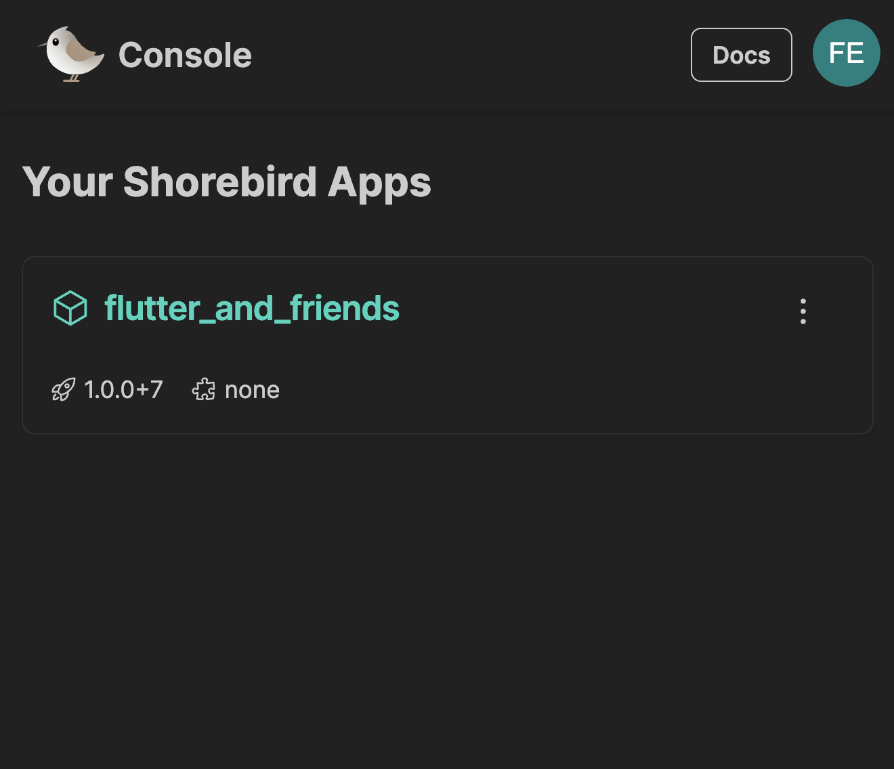
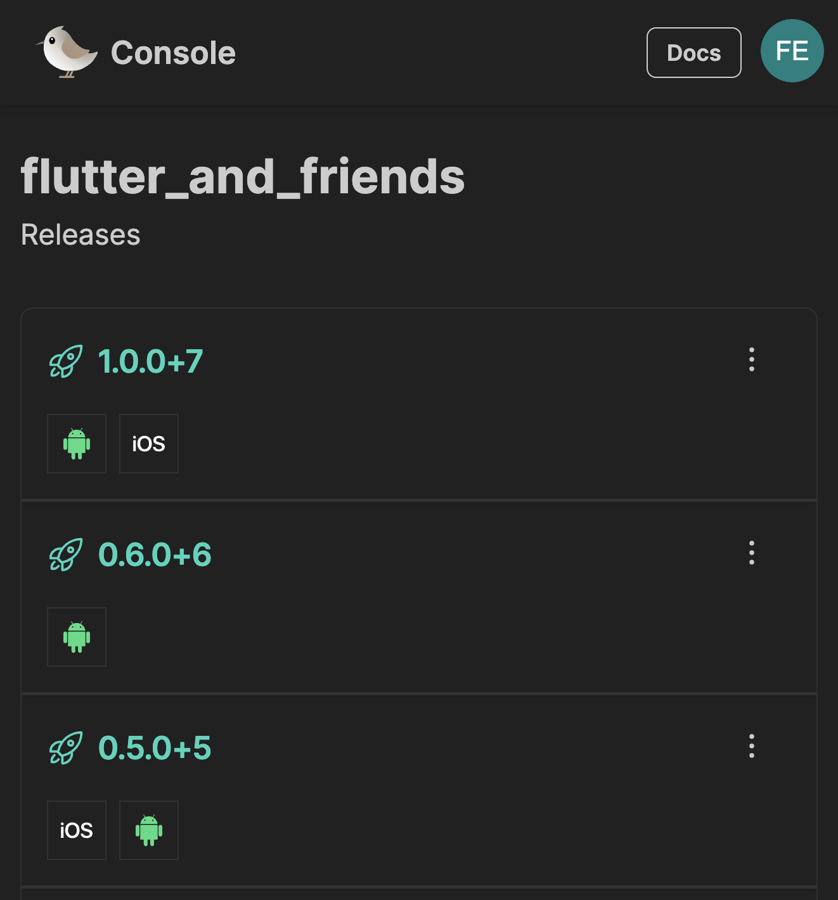

autoscale: true
footer: @felangelov - Flutter & Friends 2023
slidenumbers: true

# Shorebird: Flutter Code Push


### By: Felix Angelov

---

# 👋 Hello


---

# 🦸 Flutter Gives Us Superpowers

- 🎯 Dart
- ⚡️ Hot Reload
- 📱 Mobile (iOS + Android)
- 🖥️ Desktop (MacOS, Linux, Windows)
- 🧩 Declarative UI
- 🔌 Plugins
- 🛠️ Developer Tools

---

# 📱 Flutter & Friends App


---

# 📦 Download It


---


---


---


---


---


---

# There's only one problem...

# 😅

---


---


---


---


---


---


---

[.background-color: #1f2023]
[.text: #ffffff]


---


---

# 🐦 Shorebird Code Push

- ⚡️ Hot Restart in Production
- ✨ Change Any Dart Code
- ⏱️ Deliver Over-The-Air Updates Instantly
- 🧵 Seamless Integration
- 💸 Try For Free

Get Started: **https://shorebird.dev**

---


---

# 🧑‍🍳 Prep

[.column]

- 💨 Integrated Shorebird

  - Visited: https://console.shorebird.dev
  - Installed Shorebird CLI
  - `shorebird init`

- 📦 Created a Release

  - `shorebird release android`
  - `shorebird release ios-alpha`

- 📱 Submitted to the AppStore and PlayStore

[.column]


---

# 🚀 Initializing Shorebird

```
$ shorebird init
✓ Detecting product flavors (0.6s)
? How should we refer to this app? (flutter_and_friends) flutter_and_friends
✓ Shorebird is up-to-date (0.6s)
✓ Flutter install is correct (4.5s)

No issues detected!

🐦 Shorebird initialized successfully!

✅ A shorebird app has been created.
✅ A "shorebird.yaml" has been created.
✅ The "pubspec.yaml" has been updated to include "shorebird.yaml" as an asset.

Reference the following commands to get started:

📦 To create a new release use: "shorebird release".
🚀 To push an update use: "shorebird patch".
👀 To preview a release use: "shorebird preview".

For more information about Shorebird, visit https://shorebird.dev
```

---

# ⚙️ Shorebird Configuration

```yaml
# This file is used to configure the Shorebird updater used by your app.
# Learn more at https://docs.shorebird.dev
# This file should be checked into version control.

# This is the unique identifier assigned to your app.
# Your app_id is not a secret and is just used to identify your app
# when requesting patches from Shorebird's servers.
app_id: 8c846e87-1461-4b09-8708-170d78331aca

# auto_update controls if Shorebird should automatically update in the background on launch.
# If auto_update: false, you will need to use package:shorebird_code_push to trigger updates.
# https://pub.dev/packages/shorebird_code_push
auto_update: false
```

---

# 🧑‍💻 console.shorebird.dev



---

# Now Let's Fix it Live

# 🧑‍🔧🐦

---

### 🥳 Update Available

[.column]


[.column]

**👀 Closer Look**

- 🔔 Silent Notification

- 📦 Patch Downloaded Async In Background

- 🔐 Patch Hash Verification On Device

- 🔁 Restart To Boot From Patch

- 🛼 Automatic Rollback On Bad Patch

---

# Android & iOS

# 🥳🤖🍎

---

# ✨ Highlights

- ✅ Android 🤖
- ☑️ iOS 🍎 (alpha)
- ✅ Flavors 🍧
- ✅ Add-To-App 🧩
- ✅ CI Integration 🚦 (GitHub, Codemagic)
- ✅ Multiple Flutter Versions 🐦
- 🚧 Asset Support 🖼️ (coming soon)

---

# ⚠️ Current Limitations

- 😴 iOS Runs ~100x Slower (100% Interpreted)
- 🎈 iOS Patch Sizes Are Large (No Diffing)
- 📜 Flutter Versions >=3.10.0
- 🐎 Stable Channel Only
- 📱 Mobile Platforms Only

---

# 🤔 How Does Shorebird Work?

- 🏎️ Custom Flutter engine that includes Shorebird updater
- 🎯 Custom Dart compiler + Custom Dart interpreter
- ☁️ Compiled binaries hosted on our servers
  - 🙈 We never see your source code
- 🔌 Optional Dart bindings to interact with the updater
  - `package:shorebird_code_push`

---

# 🍰 Layers


---

# 🫳 Drop-In Replacement

```sh
# Flutter CLI
$ flutter build appbundle --release
$ flutter build ipa --release

# Shorebird CLI
$ shorebird release android
$ shorebird release ios-alpha
```

---

# 🏎️ You Are In Control


---

# 🚦 Continuous Integration

[.column]

```sh
# Generate a CI Token
$ shorebird login:ci
```

[.column]

```yaml
steps:
  - name: 📚 Git Checkout
    uses: actions/checkout@v3

  - name: 🐦 Setup Shorebird
    uses: shorebirdtech/setup-shorebird@v0
    with:
      flutter-version: 3.13.2

  - name: 🤖 Patch Android
    run: shorebird patch android --force
    env:
      SHOREBIRD_TOKEN: ${{ secrets.SHOREBIRD_TOKEN }}

  - name: 🍎 Patch iOS
    run: shorebird patch ios-alpha --force
    env:
      SHOREBIRD_TOKEN: ${{ secrets.SHOREBIRD_TOKEN }}
```

---

# ✅ Safe For Stores

[.column]
**Play Store**

“An app … may not modify, replace, or update itself using any method other than Google Play's update mechanism.” … “This restriction does not apply to code that runs in a virtual machine or an interpreter”

**Shorebird uses the Dart Virtual Machine. Similar to how other apps use JavaScript or Lua.**

[.column]
**App Store**

3.2.2. “Application may not download or install executable code. Interpreted code may be downloaded…”

**Shorebird uses a custom Dart interpreter on iOS to both comply with store guidelines and provide excellent performance.**

---

[.background-color: #26272b]
[.text: #ffffff]


---

# 🔌 Add Shorebird To Your App

## 🗓️ Workshop Tomorrow


---

# 💬 Chat With Us


**https://discord.gg/shorebird**
**@shorebirddev**

---

# Thank You!

# 💙🙏
