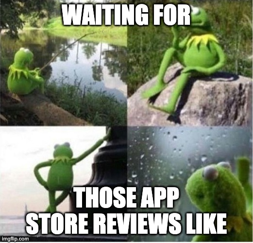

autoscale: true
footer: @felangelov - Flutter & Friends 2023
slidenumbers: true

# Flutter Code Push With Shorebird


---

# 👋 Hello


---

# 🦸 Flutter Gives Us Superpowers

- ⚡️ Hot Reload
- 📱 Mobile (iOS + Android)
- 🖥️ Desktop (MacOS, Linux, Windows)
- 🧩 Declarative UI

---

# 📱 Flutter & Friends App


---

# 📦 Download It


---

# 📅 View the Schedule


---

# 📝 View Talk Details

[Screenshot of Talk Details]

---

# 💖 Favorite Events

[Screenshot of Favorites]

---

# 🏆 View Sponsors

[Screenshot of Sponsors]

---

# ☀️/🌙 Mode

[Screenshot of Settings]

---

# There's only one problem...

# 😅

---


---


---


---


---



---


---

[.background-color: #1f2023]
[.text: #ffffff]


---

# 🐦 Shorebird Code Push

- ⚡️ Hot Restart in Production
- ✨ Change Any Dart Code
- ⏱️ Deliver Over-The-Air Updates Instantly
- 🧵 Seamless Integration
- 💸 Try For Free

Get Started: **https://shorebird.dev**

---

# Let's Fix it Live

# 🧑‍🔧🐦

---

# ✨ Highlights

- ✅ Android 🤖
- ✅ Flavors 🍧
- ✅ Add-To-App 🧩
- ✅ CI Integration 🚦 (GitHub, Codemagic)
- ✅ Multiple Flutter Versions 🐦
- ☑️ iOS 🍎 (alpha)
- 🚧 Asset Support 🖼️ (coming soon)

---

# ⚠️ Current Status

- 😴 iOS Runs ~100x Slower (100% Interpreted)
- 🎈 iOS Patch Sizes Are Large (No Diffing)
- 📜 Flutter Versions >=3.10.0

---

# 🤔 How Does Shorebird Work?

- 🏎️ Custom Flutter Engine that includes Shorebird Updater
- 🎯 Custom Dart compiler + Custom Dart interpreter
- ☁️ Compiled binaries hosted on our servers
  - 🙈 We never see your source code
- 🔌 Dart Bindings to interact with the Updater
  - `package:shorebird_code_push`

---

# 🫳 Drop-In Replacement

[.code-highlight: all]
[.code-highlight: 1]
[.code-highlight: 2]
[.code-highlight: 4]
[.code-highlight: 5]
[.code-highlight: all]

```sh
$ flutter build appbundle --release
$ shorebird release android

$ flutter build ipa --release
$ shorebird release ios-alpha
```

---

# ✅ Safe For Stores

[.column]
**Play Store**

> “An app … may not modify, replace, or update itself using any method other than Google Play's update mechanism.” … “This restriction does not apply to code that runs in a virtual machine or an interpreter”

**Shorebird uses the Dart Virtual Machine. Similar to how other apps use JavaScript or Lua.**

[.column]
**App Store**

> 3.2.2. “Application may not download or install executable code. Interpreted code may be downloaded…”

**Shorebird uses a custom Dart interpreter on iOS to both comply with store guidelines and provide excellent performance.**

---

[.background-color: #26272b]
[.text: #ffffff]


---

# 🔌 Add Shorebird To Your App
## 🗓️ Workshop Tomorrow


---

# 💬 Chat With Us


**https://discord.gg/shorebird**

---

# Thank You!

# 💙🙏
